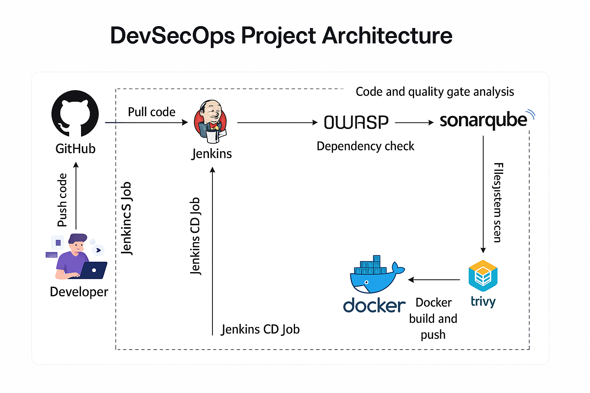
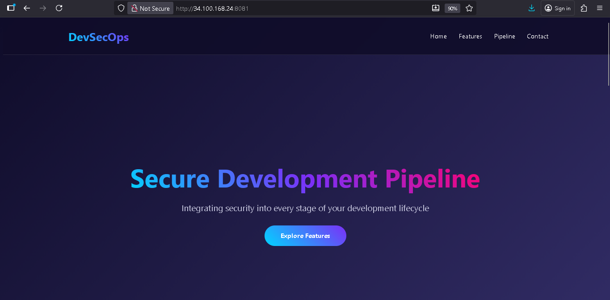

# DevSecOps CI/CD Pipeline on GCP Cloud

[](https://www.jenkins.io/)
[](https://www.sonarqube.org/)
[](https://www.docker.com/)
[](https://owasp.org/)
[](https://trivy.dev/)

## 📋 Project Overview

This project demonstrates a complete **End-to-End DevSecOps CI/CD Pipeline** deployed on **Google Cloud Platform (GCP)**. It integrates security at every stage of the development lifecycle, implementing automated security scanning, code quality analysis, vulnerability detection, and containerized deployment.

The pipeline showcases a **static HTML website** (DevSecOps Platform landing page) deployed through an automated, security-focused workflow using industry-standard tools.

## 🏗️ Architecture & Pipeline Flow

```
┌─────────────┐     ┌──────────────┐     ┌─────────────┐     ┌──────────────┐
│   Jenkins   │────▶│  SonarQube   │────▶│    OWASP    │────▶│    Trivy     │
│   Pipeline  │     │   Analysis   │     │ Dependency  │     │  FS Scan     │
└─────────────┘     └──────────────┘     │    Check    │     └──────────────┘
                            │             └─────────────┘            │
                            ▼                                        ▼
                    ┌──────────────┐                         ┌─────────────┐
                    │Sonar Quality │                         │   Docker    │
                    │     Gate     │────────────────────────▶│ Deployment  │
                    └──────────────┘                         └─────────────┘
```

### Pipeline Stages:

1. **SonarQube Analysis** - Static code analysis and quality metrics
2. **OWASP Dependency Check** - Scans for vulnerable dependencies
3. **Trivy Filesystem Scan** - Container and filesystem vulnerability scanning
4. **Sonar Quality Gate** - Enforces quality standards before deployment
5. **Docker Deployment** - Builds and deploys containerized application

## 🛠️ Technology Stack

### Core Tools:
- **Jenkins** - CI/CD orchestration and automation
- **SonarQube** - Code quality and security analysis
- **OWASP Dependency-Check** - Dependency vulnerability scanner
- **Trivy** - Comprehensive vulnerability scanner
- **Docker** - Containerization platform
- **Nginx** - Web server (Alpine-based)

### Cloud Infrastructure:
- **Google Cloud Platform (GCP)** - Cloud hosting platform
- **Compute Engine** - VM instances for Jenkins & SonarQube

### Application Stack:
- **HTML5** - Frontend markup
- **CSS3** - Styling with modern animations
- **JavaScript** - Interactive functionality

## 📦 Prerequisites

- GCP account with billing enabled
- GCP Compute Engine VM instances (minimum 2 VMs recommended):
  - **Jenkins Server**: 2 vCPUs, 4GB RAM
  - **SonarQube Server**: 2 vCPUs, 4GB RAM
- Basic knowledge of Linux, Docker, and CI/CD concepts

## 🚀 Installation & Setup Guide

### Step 1: Set Up GCP Compute Engine Instances

#### Create Jenkins Server VM:
```bash
gcloud compute instances create jenkins-server \
    --zone=us-central1-a \
    --machine-type=e2-medium \
    --image-family=ubuntu-2004-lts \
    --image-project=ubuntu-os-cloud \
    --boot-disk-size=30GB \
    --tags=http-server,https-server
```

#### Create SonarQube Server VM:
```bash
gcloud compute instances create sonarqube-server \
    --zone=us-central1-a \
    --machine-type=e2-medium \
    --image-family=ubuntu-2004-lts \
    --image-project=ubuntu-os-cloud \
    --boot-disk-size=30GB \
    --tags=http-server
```

#### Configure Firewall Rules:
```bash
# Jenkins (port 8080)
gcloud compute firewall-rules create allow-jenkins \
    --allow=tcp:8080 \
    --target-tags=http-server

# SonarQube (port 9000)
gcloud compute firewall-rules create allow-sonarqube \
    --allow=tcp:9000 \
    --target-tags=http-server

# Application (port 8081)
gcloud compute firewall-rules create allow-app \
    --allow=tcp:8081 \
    --target-tags=http-server
```

### Step 2: Install Docker

Run on **both Jenkins and SonarQube servers**:

```bash
# Update package index
sudo apt update

# Install prerequisites
sudo apt install -y apt-transport-https ca-certificates curl software-properties-common

# Add Docker GPG key
curl -fsSL https://download.docker.com/linux/ubuntu/gpg | sudo gpg --dearmor -o /usr/share/keyrings/docker-archive-keyring.gpg

# Add Docker repository
echo "deb [arch=$(dpkg --print-architecture) signed-by=/usr/share/keyrings/docker-archive-keyring.gpg] https://download.docker.com/linux/ubuntu $(lsb_release -cs) stable" | sudo tee /etc/apt/sources.list.d/docker.list > /dev/null

# Install Docker
sudo apt update
sudo apt install -y docker-ce docker-ce-cli containerd.io

# Add user to docker group
sudo usermod -aG docker $USER
newgrp docker

# Verify installation
docker --version
docker ps
```

### Step 3: Install Jenkins

On **Jenkins server**:

```bash
# Install Java (Jenkins requirement)
sudo apt update
sudo apt install -y openjdk-11-jdk

# Add Jenkins repository
curl -fsSL https://pkg.jenkins.io/debian-stable/jenkins.io-2023.key | sudo tee \
  /usr/share/keyrings/jenkins-keyring.asc > /dev/null

echo deb [signed-by=/usr/share/keyrings/jenkins-keyring.asc] \
  https://pkg.jenkins.io/debian-stable binary/ | sudo tee \
  /etc/apt/sources.list.d/jenkins.list > /dev/null

# Install Jenkins
sudo apt update
sudo apt install -y jenkins

# Start Jenkins
sudo systemctl start jenkins
sudo systemctl enable jenkins

# Get initial admin password
sudo cat /var/lib/jenkins/secrets/initialAdminPassword
```

**Access Jenkins**: `http://<JENKINS_SERVER_EXTERNAL_IP>:8080`

### Step 4: Install SonarQube

On **SonarQube server**:

```bash
# Run SonarQube container
docker run -d --name sonarqube \
    -p 9000:9000 \
    -e SONAR_ES_BOOTSTRAP_CHECKS_DISABLE=true \
    sonarqube:latest

# Verify container is running
docker ps

# Check logs
docker logs sonarqube
```

**Access SonarQube**: `http://<SONARQUBE_SERVER_EXTERNAL_IP>:9000`
- Default credentials: `admin` / `admin`
- Change password on first login

### Step 5: Install Trivy

On **Jenkins server**:

```bash
# Add Trivy repository
sudo apt-get install wget apt-transport-https gnupg lsb-release -y

wget -qO - https://aquasecurity.github.io/trivy-repo/deb/public.key | sudo apt-key add -

echo "deb https://aquasecurity.github.io/trivy-repo/deb $(lsb_release -sc) main" | sudo tee -a /etc/apt/sources.list.d/trivy.list

# Install Trivy
sudo apt-get update
sudo apt-get install trivy -y

# Verify installation
trivy --version
```

### Step 6: Configure Jenkins Plugins

1. **Access Jenkins Dashboard** → **Manage Jenkins** → **Manage Plugins**

2. **Install Required Plugins**:
   - **SonarQube Scanner**
   - **Sonar Quality Gates Plugin**
   - **OWASP Dependency-Check Plugin**
   - **Docker Pipeline Plugin**
   - **Docker Plugin**
   - **Git Plugin** (if not already installed)

3. **Restart Jenkins** after plugin installation

### Step 7: Configure SonarQube in Jenkins

#### 7.1 Generate SonarQube Token:
1. Login to SonarQube (`http://<SONARQUBE_IP>:9000`)
2. Go to **My Account** → **Security** → **Generate Tokens**
3. Enter name: `jenkins`
4. Click **Generate** and copy the token

#### 7.2 Add SonarQube Server in Jenkins:
1. **Manage Jenkins** → **Configure System**
2. Scroll to **SonarQube servers** section
3. Click **Add SonarQube**
4. Configure:
   - **Name**: `SonarServer`
   - **Server URL**: `http://<SONARQUBE_IP>:9000`
   - **Server authentication token**: Add credential
     - Kind: **Secret text**
     - Secret: Paste SonarQube token
     - ID: `sonar-token`
5. Click **Save**

#### 7.3 Configure SonarQube Scanner:
1. **Manage Jenkins** → **Global Tool Configuration**
2. Scroll to **SonarQube Scanner** section
3. Click **Add SonarQube Scanner**
4. Configure:
   - **Name**: `SonarScanner`
   - **Install automatically**: ✓ (checked)
   - Select latest version
5. Click **Save**

### Step 8: Configure OWASP Dependency-Check

1. **Manage Jenkins** → **Global Tool Configuration**
2. Scroll to **Dependency-Check** section
3. Click **Add Dependency-Check**
4. Configure:
   - **Name**: `dc`
   - **Install automatically**: ✓ (checked)
   - Select latest version (e.g., 8.4.0)
5. Click **Save**

### Step 9: Set Up Project Repository

1. **Create project directory** on Jenkins server:
```bash
mkdir -p ~/devsecops-project
cd ~/devsecops-project
```

2. **Create Static directory**:
```bash
mkdir Static
cd Static
```

3. **Create files** (copy content from provided documents):
   - `index.html` - Main HTML file
   - `style.css` - Stylesheet
   - `script.js` - JavaScript file
   - `Dockerfile` - Container configuration

4. **Move Dockerfile to project root**:
```bash
mv Dockerfile ../
cd ..
```

5. **Create Jenkinsfile** in project root (copy content from provided document)

6. **Initialize Git repository** (optional but recommended):
```bash
git init
git add .
git commit -m "Initial commit"
```

### Step 10: Create Jenkins Pipeline

1. **Jenkins Dashboard** → **New Item**
2. Enter name: `DevSecOps-Pipeline`
3. Select **Pipeline** → Click **OK**
4. Configure pipeline:
   
   **Option A - Pipeline Script from SCM:**
   - Pipeline → Definition: **Pipeline script from SCM**
   - SCM: **Git**
   - Repository URL: Your Git repository URL
   - Branch: `*/main` or `*/master`
   - Script Path: `Jenkinsfile`

   **Option B - Pipeline Script:**
   - Pipeline → Definition: **Pipeline script**
   - Copy and paste the Jenkinsfile content directly

5. Click **Save**

### Step 11: Update Jenkinsfile Configuration

Before running the pipeline, update the following in your `Jenkinsfile`:

```groovy
// Line 12: Update SonarQube server IP
-Dsonar.host.url=http://<YOUR_SONARQUBE_IP>:9000 \

// Line 13: Update with your SonarQube token
-Dsonar.login=<YOUR_SONARQUBE_TOKEN>
```

### Step 12: Run the Pipeline

1. Go to your pipeline: **DevSecOps-Pipeline**
2. Click **Build Now**
3. Monitor the build progress in **Console Output**

### Step 13: Verify Deployment

1. **Check Docker container**:
```bash
docker ps
```
You should see a container named `myproject` running on port 8081

2. **Access the application**:
   - Open browser: `http://<JENKINS_SERVER_EXTERNAL_IP>:8081`
   - You should see the DevSecOps Platform landing page

3. **View reports**:
   - **SonarQube**: `http://<SONARQUBE_IP>:9000` → Projects → myproject
   - **OWASP Report**: Jenkins build → **Dependency-Check Results**
   - **Trivy Report**: Check `trivy-report.txt` in workspace

## 📊 Pipeline Stages Explained

### 1. SonarQube Analysis
- Performs static code analysis
- Checks code quality metrics
- Identifies code smells, bugs, and vulnerabilities
- Generates detailed reports in SonarQube dashboard

### 2. OWASP Dependency Check
- Scans project dependencies for known vulnerabilities
- References CVE (Common Vulnerabilities and Exposures) database
- Generates HTML report with vulnerability details
- Critical for identifying outdated/vulnerable libraries

### 3. Trivy Scan
- Comprehensive filesystem vulnerability scanner
- Detects OS package vulnerabilities
- Scans for misconfigurations
- Generates detailed text report

### 4. Sonar Quality Gate
- Enforces quality standards before deployment
- Configurable thresholds for:
  - Code coverage
  - Duplicated code
  - Maintainability rating
  - Security rating
- Aborts pipeline if quality gate fails (configurable)

### 5. Deployment
- Stops and removes existing container (if any)
- Removes old Docker image (if exists)
- Builds new Docker image from Dockerfile
- Runs container with Nginx serving static content
- Exposes application on port 8081

## 🔒 Security Features

✅ **Static Application Security Testing (SAST)** - SonarQube  
✅ **Software Composition Analysis (SCA)** - OWASP Dependency-Check  
✅ **Container Security Scanning** - Trivy  
✅ **Quality Gates** - Automated quality enforcement  
✅ **Vulnerability Reporting** - Comprehensive security reports  
✅ **Shift-Left Security** - Security integrated early in pipeline

## 📁 Project Structure

```
devsecops-project/
│
├── Jenkinsfile                 # CI/CD pipeline definition
├── Dockerfile                  # Container configuration
│
└── Static/                     # Web application files
    ├── index.html             # Main HTML page
    ├── style.css              # Stylesheet
    └── script.js              # JavaScript functionality
```

## 🔧 Troubleshooting

### Common Issues:

**1. Jenkins can't connect to SonarQube:**
- Verify SonarQube is running: `docker ps`
- Check firewall rules allow port 9000
- Ensure correct IP address in Jenkinsfile

**2. Docker commands fail in pipeline:**
- Add jenkins user to docker group: `sudo usermod -aG docker jenkins`
- Restart Jenkins: `sudo systemctl restart jenkins`

**3. Port 8081 already in use:**
- Find process using port: `sudo lsof -i :8081`
- Kill process or change port in Jenkinsfile

**4. OWASP Dependency-Check fails:**
- Increase Jenkins Java heap size in `/etc/default/jenkins`
- Update NVD database: May take time on first run

**5. Trivy scan fails:**
- Update Trivy: `sudo apt-get update && sudo apt-get upgrade trivy`
- Check internet connectivity for vulnerability database updates

## 📈 Monitoring & Reports

### Access Security Reports:

1. **SonarQube Dashboard**:
   - URL: `http://<SONARQUBE_IP>:9000`
   - View code quality metrics, security hotspots, and vulnerabilities

2. **OWASP Dependency Report**:
   - Jenkins build page → **Dependency-Check Results**
   - Downloads HTML report with vulnerability details

3. **Trivy Report**:
   - Located in Jenkins workspace: `trivy-report.txt`
   - View via: `cat /var/lib/jenkins/workspace/DevSecOps-Pipeline/trivy-report.txt`

## 🎯 Best Practices Implemented

- ✅ Automated security scanning at every build
- ✅ Quality gates to prevent vulnerable code deployment
- ✅ Containerized deployment for consistency
- ✅ Infrastructure as Code (Jenkinsfile)
- ✅ Comprehensive vulnerability reporting
- ✅ Separation of concerns (different stages)
- ✅ Fail-fast approach with quality gates

## 🚀 Future Enhancements

- [ ] Implement Dynamic Application Security Testing (DAST)
- [ ] Add Kubernetes deployment
- [ ] Integrate Slack/email notifications
- [ ] Implement automated rollback mechanism
- [ ] Add penetration testing stage
- [ ] Integrate with cloud-native security tools (GCP Security Command Center)
- [ ] Implement secrets management (HashiCorp Vault)

## 📝 Screenshot






## 👤 Author

**Ujwal Nagrikar**  
DevSecOps Engineer

---

## 📞 Support

For issues or questions:
- Create an issue in the repository
- Check Jenkins/SonarQube logs for detailed error messages
- Review GCP Compute Engine logs

---

**⭐ If you found this project helpful, please star the repository!**
